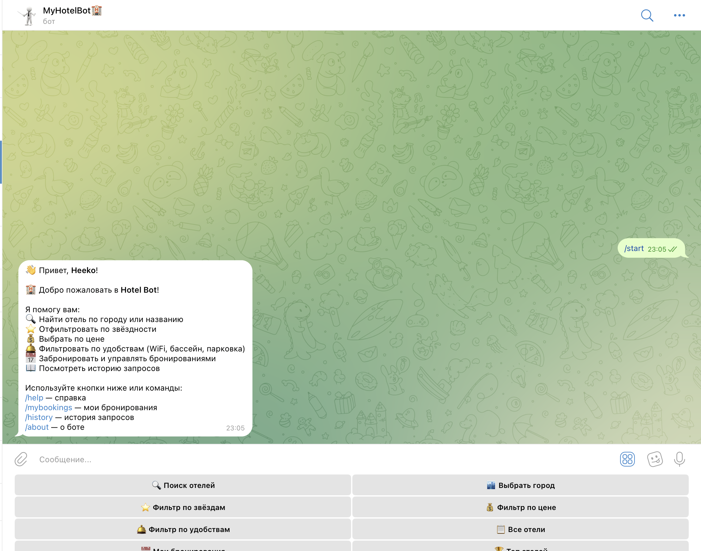
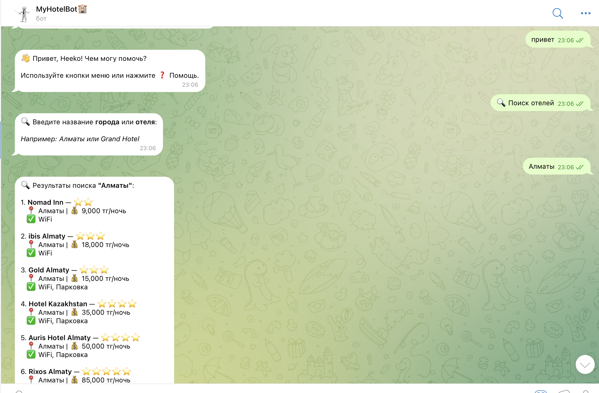
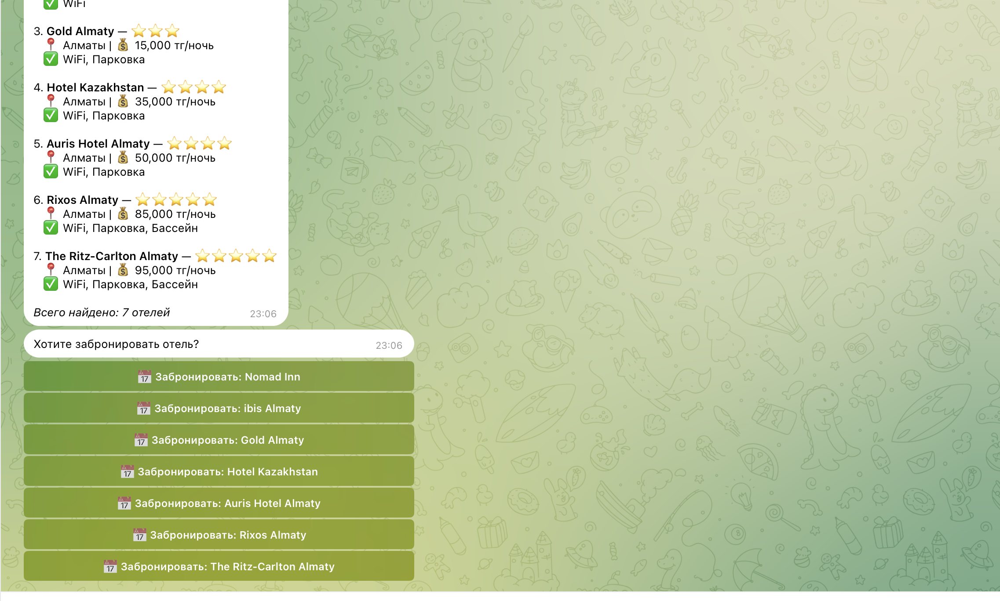
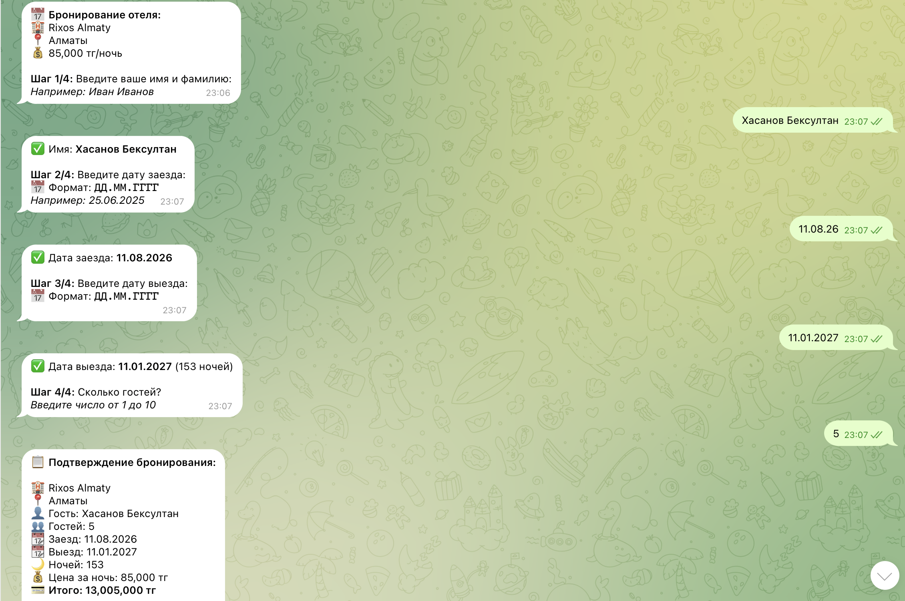
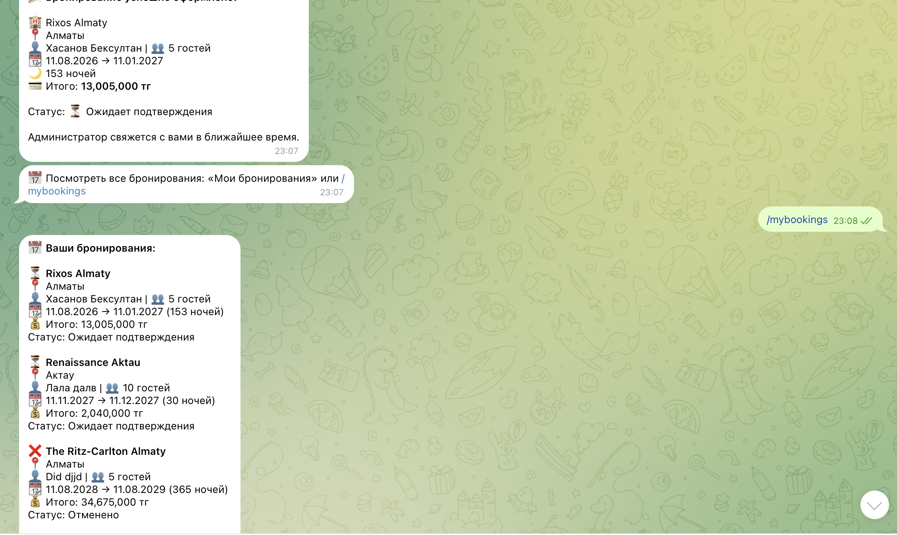
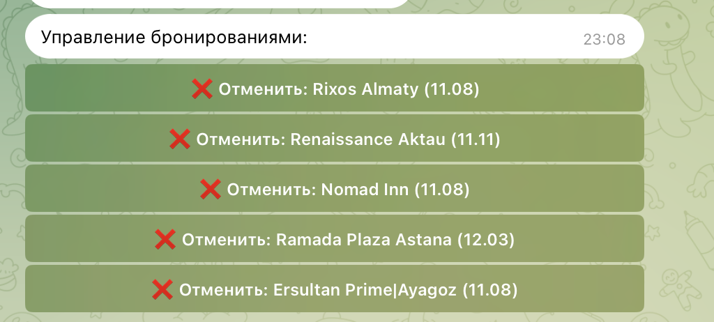
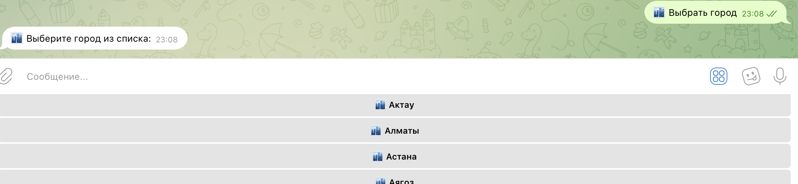
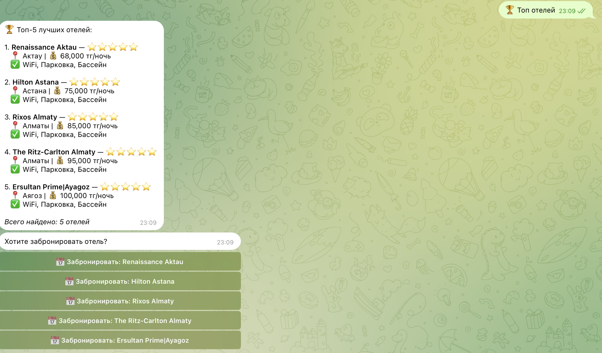
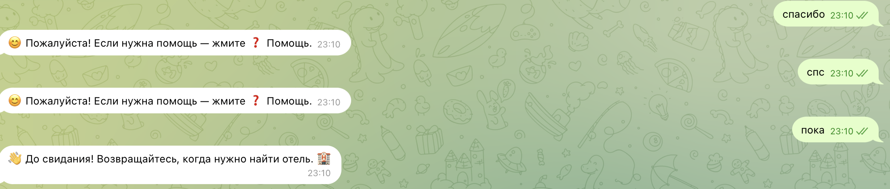

# 🏨 Hotel Bot — Telegram Bot for Searching and Booking Hotels

## Project Description

**Hotel Bot** is a Telegram bot that allows users to search for hotels based on various criteria and book rooms directly within the messenger. The bot is connected to a Django backend and stores all its data in a database.

**Topic 29:** Hotel Chatbot — Search and Filtration

---

## Technologies Used

| Technology | Purpose |
|---|---|
| Python 3.10+ | Main development language |
| pyTelegramBotAPI (telebot) | Telegram Bot API |
| Django 4.x | ORM and Web Admin Panel |
| SQLite / PostgreSQL | Database |
| python-dotenv | Secure token environment storage |

---

## Project Structure

hotel_project/
├── hotel_project/
│   ├── settings.py
│   ├── urls.py
│   └── wsgi.py
├── hotels_app/
│   ├── models.py        # Hotel, Booking, UserQuery
│   ├── admin.py
│   ├── views.py
│   └── migrations/
├── bot/
│   └── bot.py           # Main bot script
├── .env                 # Environment variables (Do not commit!)
├── .env.example         # Example of .env file
├── requirements.txt
├── manage.py
└── README.md

---

## Installation Instructions

### 1. Clone the Repository
```bash
git clone [https://github.com/your_username/hotel-bot.git](https://github.com/your_username/hotel-bot.git)
cd hotel-bot
2. Create a Virtual Environment
Bash
python -m venv venv
source venv/bin/activate        # Linux/Mac
venv\Scripts\activate           # Windows
3. Install Dependencies
Bash
pip install -r requirements.txt
4. Configure Environment Variables
Create a .env file in the root directory of the project:
BOT_TOKEN=your_token_from_BotFather
DJANGO_SECRET_KEY=your_secret_key
DEBUG=True
5. Apply Django Migrations
Bash
python manage.py migrate
python manage.py createsuperuser
6. Add Sample Data
Bash
python manage.py shell
# Or via Django admin panel: [http://127.0.0.1:8000/admin/](http://127.0.0.1:8000/admin/)
Run Instructions
Bash
# Activate the virtual environment
source venv/bin/activate

# Launch the bot
python bot/bot.py
The bot will start running and listening for messages. Logs are saved in bot.log.
Main Bot Features
Feature	Command / Button
Greeting & Menu	/start
Help	/help or ❓ Help
Search by city/name	🔍 Search Hotels
Select a city from the list	🏙️ Select City
Filter by stars (1-5)	⭐ Filter by Stars
Filter by price	💰 Filter by Price
Filter by amenities	🛎️ Filter by Amenities
View all hotels	📋 All Hotels
My bookings	📅 My Bookings or /mybookings
Request history	/history
About the bot	/about
Workflow Examples
Hotel Search:
User: 🔍 Search Hotels
Bot: Enter the name of a city or a hotel
User: Almaty
Bot: 🏙️ Hotels in Almaty:
     1. Grand Hotel — ⭐⭐⭐⭐⭐
        📍 Almaty | 💰 45,000 KZT/night
     ...
Booking Process (4 steps):
→ Step 1: Guest's name
→ Step 2: Check-in date (DD.MM.YYYY)
→ Step 3: Check-out date (DD.MM.YYYY)
→ Step 4: Number of guests
→ Confirmation screen with the total price summary

## Interface Screenshots















Error Handling
The bot successfully handles the following edge cases and errors:
 Empty input
 Incorrect date format
 Booking dates in the past✅ Check-out date set earlier than check-in date
 Invalid name format (containing numbers or special characters)
 Unknown commands
 Database connection errors
 Missing database records
Evaluation Criteria
 Full working implementation in Python
 Interactive Telegram interface using custom buttons
 10+ standard request scenarios handled
 Dialogue state management support
 Data persistence (Django ORM + DB)
 User query history tracking
 Comprehensive error handling
 Security (sensitive tokens stored in .env)
 Logging configuration
 Structured project architecture and complete README
